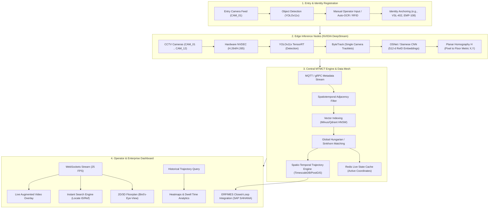
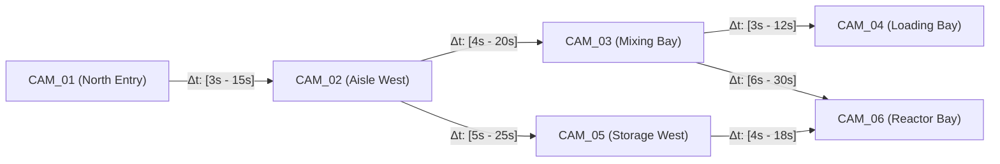
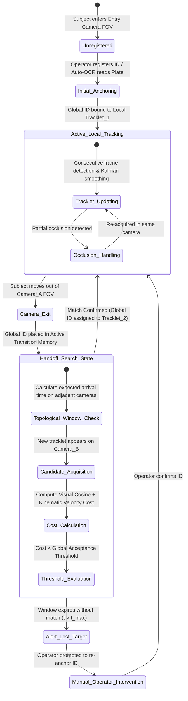
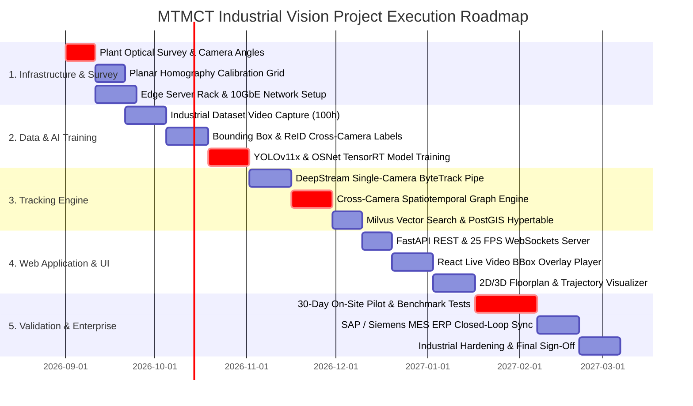

# INDUSTRIAL MULTI-CAMERA TRACKING SYSTEM (MTMCT)
## 📐 Master Visual Planning, Architecture & Implementation Blueprint

---

## 📑 TABLE OF CONTENTS
1. [Executive Visual Pipeline Overview](#1-executive-visual-pipeline-overview)
2. [Factory Floor & Camera Network Layout (Bird's-Eye-View)](#2-factory-floor--camera-network-layout-birds-eye-view)
3. [End-to-End Data & Streaming Architecture](#3-end-to-end-data--streaming-architecture)
4. [Cross-Camera Handoff & MTMCT State Machine](#4-cross-camera-handoff--mtmct-state-machine)
5. [UI/UX Wireframes & Dashboard Layout Blueprint](#5-uiux-wireframes--dashboard-layout-blueprint)
6. [Data Schemas & Mathematical Formulations](#6-data-schemas--mathematical-formulations)
7. [Visual Work Breakdown Structure (WBS) & Gantt Roadmap](#7-visual-work-breakdown-structure-wbs--gantt-roadmap)
8. [Risk Matrix & Mitigation Strategies](#8-risk-matrix--mitigation-strategies)

---

## 1. EXECUTIVE VISUAL PIPELINE OVERVIEW



---

## 2. FACTORY FLOOR & CAMERA NETWORK LAYOUT (BIRD'S-EYE-VIEW)

The plant floor is modeled as a Cartesian coordinate grid $(X, Y)$ in meters $(0 \le X \le 100\text{m}, 0 \le Y \le 60\text{m})$ partitioned into calibrated camera viewing zones:

```
+----------------------------------------------------------------------------------------------------+ (100m, 60m)
| [GATE 1: NORTH ENTRY]                                                          [LOADING BAY 4]     |
|   ┌───────────────────────────┐                         ┌───────────────────────────┐              |
|   │     CAM_01 (Coverage)     │                         │     CAM_04 (Coverage)     │              |
|   │   (Entry Registration)    │                         │   (Outbound Logistics)    │              |
|   └─────────────┬─────────────┘                         └─────────────▲─────────────┘              |
|                 │                                                     │                            |
|                 │                                                     │                            |
|                 ▼                                                     │                            |
|   ┌───────────────────────────┐      AISLE 1 (TRANSITION)     ┌───────────────────────────┐        |
|   │     CAM_02 (Coverage)     │==============================>│     CAM_03 (Coverage)     │        |
|   │   (Aisle West Corridor)   │  [t_min: 4s, t_max: 20s]      │   (Chemical Mixing Bay)   │        |
|   └─────────────┬─────────────┘                               └─────────────┬─────────────┘        |
|                 │                                                           │                      |
|                 │                                                           │                      |
|                 ▼                                                           ▼                      |
|   ┌───────────────────────────┐                               ┌───────────────────────────┐        |
|   │     CAM_05 (Coverage)     │==============================>│     CAM_06 (Coverage)     │        |
|   │  (High-Bay Storage West)  │     AISLE 2 (TRANSITION)      │  (Reactor & Vessel Area)  │        |
|   └───────────────────────────┘                               └───────────────────────────┘        |
|                                                                                                    |
| [GATE 2: SOUTH ENTRY]                                                          [MAINTENANCE BAY]   |
+----------------------------------------------------------------------------------------------------+ (0,0)
```

### Camera Network Topology Graph & Transition Matrix



---

## 3. END-TO-END DATA & STREAMING ARCHITECTURE

```
+----------------------------------------------------------------------------------------------------+
|                                    CCTV CAMERAS (1080p @ 25 FPS RTSP)                              |
+----------------------------------------------------------------------------------------------------+
                                                  │
                                                  ▼ RTSP over 10 GbE Factory LAN
+----------------------------------------------------------------------------------------------------+
|                         EDGE AI INFERENCE APPLIANCE (NVIDIA RTX 6000 Ada / Jetson)                 |
|  +-----------------------------------------------------------------------------------------------+ |
|  | Hardware NVDEC Decoder (GStreamer Plugin)                                                     | |
|  +-----------------------------------------------------------------------------------------------+ |
|  | Primary Detector: YOLOv11x TensorRT FP16 (Batch Size = 8, Latency = 8.2 ms)                   | |
|  +-----------------------------------------------------------------------------------------------+ |
|  | Single Camera Tracker: ByteTrack (Kalman State Filter + IoU Associator)                       | |
|  +-----------------------------------------------------------------------------------------------+ |
|  | Feature Extractor: OSNet-IBN (Persons) / Contrastive CNN (Vessels) ➔ 512-dim L2 Vector        | |
|  +-----------------------------------------------------------------------------------------------+ |
|  | Coordinate Projector: H_c * [u, v, 1]^T ➔ Metric Floor Coordinates (X, Y)                     | |
|  +-----------------------------------------------------------------------------------------------+ |
|  | Output Serializer: Protobuf / JSON Tracklet Payload (Size < 1.2 KB / frame)                   | |
+----------------------------------------------------------------------------------------------------+
                                                  │
                                                  ▼ gRPC / MQTT Stream (< 100 KB/s total bandwidth)
+----------------------------------------------------------------------------------------------------+
|                                   CENTRAL DISTRIBUTED BACKEND CLUSTER                              |
|  +-----------------------------------------------------------------------------------------------+ |
|  | Trajectory Message Ingress & Validation Buffer (Redis Streams / Kafka)                         | |
|  +-----------------------------------------------------------------------------------------------+ |
|  | Cross-Camera Spatiotemporal Graph Optimizer (LAPJV / Sinkhorn Global Solver)                  | |
|  +-----------------------------------------------------------------------------------------------+ |
|  | Vector Similarity Engine (Milvus Vector DB with HNSW cosine metric index)                      | |
|  +-----------------------------------------------------------------------------------------------+ |
|  | Spatiotemporal Time-Series Store (TimescaleDB / PostgreSQL + PostGIS Geometry)                | |
+----------------------------------------------------------------------------------------------------+
                                                  │
                                                  ▼ WebSockets & REST API (< 50 ms latency)
+----------------------------------------------------------------------------------------------------+
|                                OPERATOR & MANAGEMENT WEB APPLICATION                               |
|  - Real-time Video Stream with Dynamic Bounding Box & ID Label Overlay (WebRTC / WebCodecs)       |
|  - Global Identity Search Bar with Auto-Camera Switching                                           |
|  - Interactive 2D/3D Bird's-Eye-View Floorplan (Three.js / Leaflet Canvas)                         |
|  - Historical Trajectory Playback, Heatmap Aggregations & ERP Stage-Gate Status                   |
+----------------------------------------------------------------------------------------------------+
```

---

## 4. CROSS-CAMERA HANDOFF & MTMCT STATE MACHINE



---

## 5. UI/UX WIREFRAMES & DASHBOARD LAYOUT BLUEPRINT

### Master Operator Control Dashboard Wireframe

```
+----------------------------------------------------------------------------------------------------+
| [FACTORY AI LOGO]  🏭 Plant Vision 360  | [🔍 Search: "VSL-402" or "EMP-108" ] [GO] | [ 🔔 Alerts (2) ] [👤 Admin] |
+----------------------------------------------------------------------------------------------------+
| LIVE MULTI-CAMERA MATRIX (Active Track Focus)      | BIRD'S-EYE-VIEW (BEV) 2D/3D PLANT FLOOR MAP   |
| +------------------------------------------------+ | +-------------------------------------------+ |
| | CAMERA 02: AISLE WEST PROCESSING (LIVE 🔴)     | | | [Zone 1: North Gate]                      | |
| |  --------------------------------------------  | | |    • EMP-108 (5.2m, 8.4m)                 | |
| |  |                                          |  | | |        │                                  | |
| |  |         [ VSL-402: Reactor Tank ]        |  | | |        ▼                                  | |
| |  |         +-----------------------+        |  | | | [Zone 2: Aisle West]                      | |
| |  |         |   [VESSEL 402]        |        |  | | |    ★ VSL-402 (24.5m, 12.8m) [ACTIVE FOCUS]| |
| |  |         |                       |        |  | | |    • FL-04 (Forklift moving at 1.8 m/s)   | |
| |  |         |                       |        |  | | |                                           | |
| |  |         +-----------------------+        |  | | | [Zone 3: Chemical Mixing Bay]             | |
| |  |           (Footprint: 24.5m, 12.8m)      |  | | |    • EMP-304                              | |
| |  |                                          |  | | |                                           | |
| |  --------------------------------------------  | | +-------------------------------------------+ |
| | Camera: CAM_02 | FPS: 25.0 | Latency: 42ms     | | | [ ] Show Heatmap  [x] Show Path  [ ] Geofence| |
| +------------------------------------------------+ +-------------------------------------------+ |
| HISTORICAL SPATIAL TRAJECTORY SCRUBBER & DWELL TIME ANALYTICS                                       |
| +------------------------------------------------------------------------------------------------+ |
| | Subject: VSL-402 | Date: 2026-09-02 | Total Distance: 142.6m | Current Status: Mixing Processing | |
| | [◄◄] [►] [►►]  |===■==============================================================| 14:32:10   | |
| | Dwell Timeline: [Gate 1: 5m] ───> [Aisle West: 12m] ───> [Mixing Bay: 45m (In Progress)]        | |
| +------------------------------------------------------------------------------------------------+ |
| REAL-TIME SYSTEM TELEMETRY & ALERTS                                                                |
| [14:31:02] INFO: Target VSL-402 successfully handed off from CAM_01 ➔ CAM_02 (Confidence: 0.94)    |
| [14:30:15] WARN: Forklift FL-04 proximity alert with Worker EMP-108 (Distance: 1.8m < 2.0m safe)   |
+----------------------------------------------------------------------------------------------------+
```

---

## 6. DATA SCHEMAS & MATHEMATICAL FORMULATIONS

### 1. Global Association Cost Formulation
For tracklet $i$ on camera $c_1$ and tracklet $j$ on camera $c_2$:

$$\mathcal{C}_{\text{total}}(i, j) = \begin{cases} 
w_1 \cdot \mathcal{D}_{\text{cosine}}(\mathbf{f}_i, \mathbf{f}_j) + w_2 \cdot \frac{\|\mathbf{P}_j - \mathbf{P}_i - \mathbf{v}_i \Delta t\|}{\sigma_{\text{dist}}} + w_3 \cdot \frac{|\Delta t - \bar{T}_{c_1 \to c_2}|}{\sigma_{\text{time}}}, & \text{if } \Delta t \in [T_{\min}, T_{\max}] \\
+\infty, & \text{otherwise}
\end{cases}$$

Where:
* $\mathcal{D}_{\text{cosine}}(\mathbf{f}_i, \mathbf{f}_j) = 1 - \frac{\mathbf{f}_i \cdot \mathbf{f}_j}{\|\mathbf{f}_i\| \|\mathbf{f}_j\|}$ (Visual ReID embedding distance).
* $\Delta t = t_j^{\text{start}} - t_i^{\text{end}}$ (Transition duration between camera fields of view).
* $\bar{T}_{c_1 \to c_2}$ is the mean historical transit time between cameras $c_1$ and $c_2$.
* $w_1 = 0.50, w_2 = 0.30, w_3 = 0.20$ (Calibrated weight parameters).

### 2. Live Coordinate Protobuf / JSON Payload
```json
{
  "timestamp": 1756801930.452,
  "camera_id": "CAM_02_AISLE_WEST",
  "subject_id": "VSL-402",
  "label": "Chemical Reactor Vessel #402",
  "class_name": "vessel_tank",
  "confidence": 0.942,
  "bbox_pixels": [320.5, 180.2, 480.1, 420.8],
  "floor_coordinates_meters": {
    "x": 24.52,
    "y": 12.84,
    "velocity_vector": [0.45, 0.12]
  },
  "safety_status": {
    "in_restricted_zone": false,
    "proximity_warning": false
  },
  "reid_embedding_vector_id": "emb_9f81a2c34"
}
```

---

## 7. VISUAL WORK BREAKDOWN STRUCTURE (WBS) & GANTT ROADMAP



---

## 8. RISK MATRIX & MITIGATION STRATEGIES

| Risk ID | Risk Description | Severity | Probability | Automated Mitigation Action |
| :--- | :--- | :---: | :---: | :--- |
| **RSK-01** | **Uniform PPE Visual Ambiguity:** Workers wearing identical boiler suits causing false ReID matching. | **High** | **High** | Enforce Spatiotemporal Kinematic Gating. Disallow matches that violate physical velocity bounds ($>2.5\text{ m/s}$) or non-adjacent camera transitions. |
| **RSK-02** | **Heavy Occlusion by Cranes/Tanks:** Target disappears for $>15$ seconds behind machinery. | **High** | **Med** | Maintain active tracklet memory bank in Redis with decay window of 60s. Use constant-velocity trajectory projection. |
| **RSK-03** | **Network Latency / Frame Drops:** 30+ streams causing packet loss over factory switch. | **Med** | **Med** | Deploy Edge-Fog architecture. Process video locally on Edge nodes and only stream JSON metadata ($<50\text{ KB/s}$) to central server. |
| **RSK-04** | **Operator Registration Error:** Typo during initial entry registration at Gate camera. | **Med** | **High** | Implement Zero-Operator Autonomous Registration fusing Barcode/ArUco OCR on vessels and RFID turnstile taps for personnel. |
| **RSK-05** | **Camera Vibration / Optical Drift:** High-vibration machinery knocking camera out of calibration. | **Low** | **Med** | Run automated daily background feature-point alignment to verify that homography matrix $\mathbf{H}_c$ remains within $2\text{ cm}$ error tolerance. |

---

*Document generated and saved to: `D:\Industrial_MultiCamera_Tracking\docs\visual_project_plan.md`*
